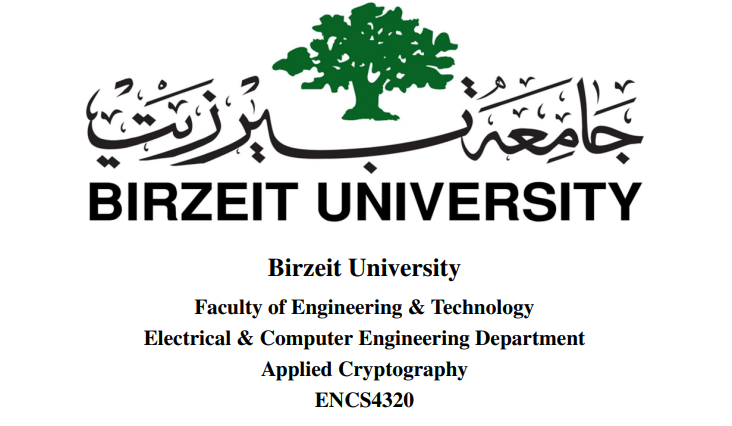
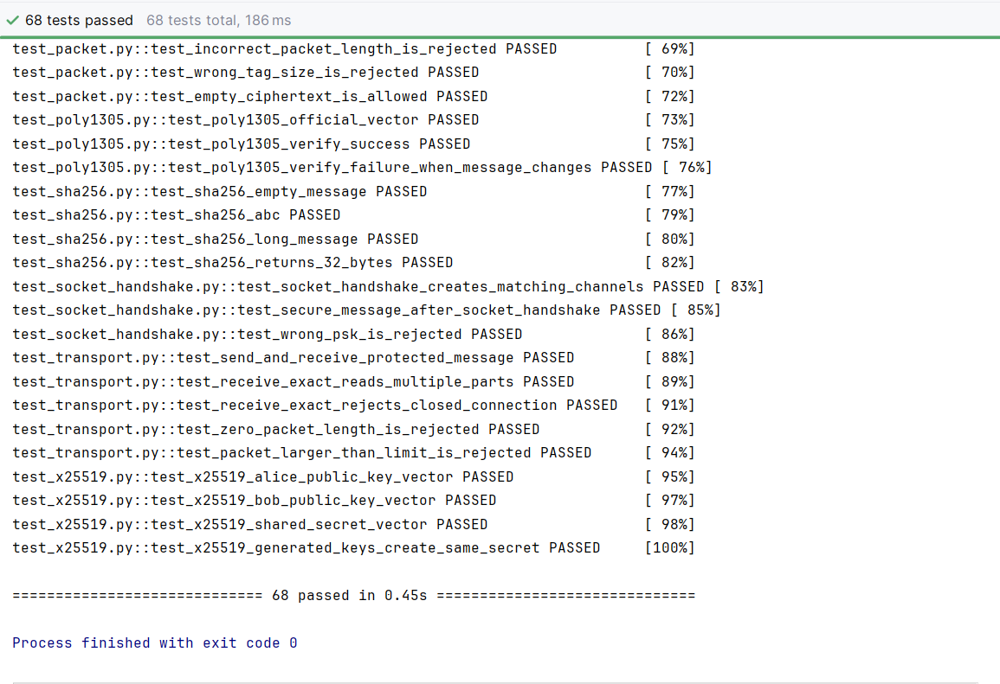
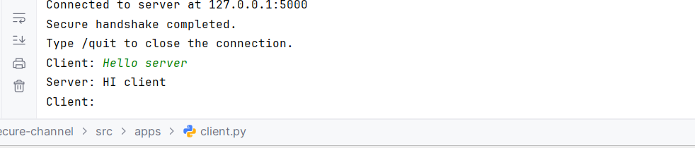
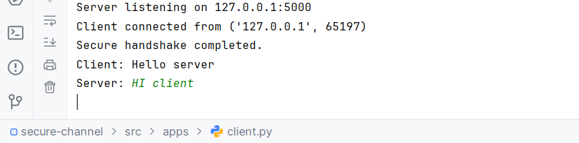

  

# SecureChannel

## Final Project Report

 

**Prepared by**

Majd Abdalkareem — 1211297 
Ayham Rimawi — 1220746

 

**Course Instructors**

Dr. Ahmad Shawahneh 
Dr. Mohammad Hussien

 

**Teaching Assistant**

Tareq Odeh

 

**June 2026**

# SecureChannel Report

## Team Members

* Majd Abdalkareem — 1211297
* Ayham Rimawi — 1220746

## Project Description

SecureChannel is a Python client-server application that provides secure text communication over a TCP connection. The project implements the required cryptographic primitives from scratch and combines them into a complete secure communication protocol.

## System Design

SecureChannel consists of a client and a server communicating over TCP. During the handshake, both sides generate ephemeral X25519 key pairs and authenticate the handshake transcript using HMAC-SHA256 with a pre-shared key.

The X25519 shared secret, pre-shared key, and transcript hash are used with HKDF-SHA256 to derive separate encryption keys and nonce bases for each communication direction. Messages are protected using ChaCha20-Poly1305, while sequence numbers prevent replayed or out-of-order messages.

## Key Schedule

After the client and server exchange their ephemeral X25519 public keys, both sides compute the same shared secret.

During key derivation:

* The X25519 shared secret is used as the input keying material.
* The pre-shared key is used during HKDF extraction.
* The SHA-256 hash of the authenticated handshake transcript provides session context.

HKDF-SHA256 derives the following values:

* A 32-byte client-to-server encryption key.
* A 32-byte server-to-client encryption key.
* A 12-byte client-to-server nonce base.
* A 12-byte server-to-client nonce base.

Using separate keys and nonce bases for each direction prevents the client and server from reusing the same cryptographic material.

## Nonce Construction

Each communication direction has its own 12-byte nonce base. For every message, the current sequence number is encoded into 12 bytes and XORed with the nonce base to produce the final ChaCha20-Poly1305 nonce.

Because the sequence number increases after every successfully processed message, each nonce is unique for the same session key. The client-to-server and server-to-client directions also use different nonce bases.

## Protocol Flow

1. The client connects to the server over TCP.
2. Both sides generate ephemeral X25519 key pairs.
3. They exchange their public keys and construct the same handshake transcript.
4. The transcript is authenticated using HMAC-SHA256 with the pre-shared key.
5. Both sides calculate the same X25519 shared secret.
6. HKDF-SHA256 derives matching directional session keys and nonce bases.
7. Text messages are encrypted and authenticated using ChaCha20-Poly1305.
8. Each message includes a sequence number to prevent replay attacks.
9. Either side can close the connection using the `/quit` command.

## Cryptographic Components

* **SHA-256:** Produces fixed-size message digests.
* **HMAC-SHA256:** Authenticates the handshake using the pre-shared key.
* **HKDF-SHA256:** Derives separate session keys and nonce bases.
* **X25519:** Establishes a shared secret using ephemeral key pairs.
* **ChaCha20:** Encrypts the message content.
* **Poly1305:** Produces authentication tags for integrity.
* **ChaCha20-Poly1305:** Combines encryption and authentication for secure messages.

## Security Properties

* **Confidentiality:** Message contents are encrypted using ChaCha20.
* **Integrity:** Poly1305 detects modified ciphertext and message headers.
* **Handshake Authentication:** HMAC-SHA256 verifies that both sides know the same pre-shared key.
* **Replay Protection:** Strictly increasing sequence numbers reject repeated or out-of-order messages.
* **Key Separation:** Different keys and nonce bases are used for each communication direction.
* **Authenticated Headers:** The plaintext message header is included as additional authenticated data.
* **Ephemeral Key Exchange:** New X25519 key pairs are generated for every connection.

## Testing and Validation

The project includes 68 automated tests. The tests verify the cryptographic primitives using official test vectors and check the complete protocol behavior.

The test suite checks:

* Official cryptographic test vectors.
* Successful encryption and decryption.
* Modified ciphertext and authentication tags.
* Modified authenticated headers.
* Incorrect pre-shared keys.
* Replayed and out-of-order messages.
* Packet serialization and parsing errors.
* TCP transport behavior.
* Socket handshake behavior.
* Successful secure communication between the client and server.

All 68 tests pass successfully.

## Execution Screenshots

### Complete Test Suite

The following screenshot shows that all 68 automated tests passed successfully.

### Secure Client-Server Communication

The following screenshots show a successful secure handshake and message exchange between the client and server.

## Implementation Structure

The project is divided into separate modules:

* `src/crypto/` contains the cryptographic primitives.
* `src/protocol/` contains the handshake, secure-channel logic, message format, packet format, and TCP transport.
* `src/apps/` contains the client and server applications.
* `tests/` contains the complete automated test suite.
* `report/screenshots/` contains screenshots used in the project report.

## Message Format

Each protected message contains:

* A plaintext header containing the protocol version, message type, sender identity, and sequence number.
* The encrypted message content.
* A 16-byte Poly1305 authentication tag.

The plaintext header is used as additional authenticated data. Therefore, any modification to the header causes authentication to fail.

Before transmission over TCP, the protected message is placed inside a length-prefixed packet so that the receiver can determine the complete packet size.

## Current Limitations

* The server supports one client connection at a time.
* The application currently supports text messages only.
* Both sides must manually enter the same pre-shared key.
* File transfer is not currently implemented.
* A graphical user interface is not currently implemented.

## References

* RFC 8439: ChaCha20 and Poly1305 for IETF Protocols.
* RFC 7748: Elliptic Curves for Security, including X25519.
* RFC 5869: HMAC-based Extract-and-Expand Key Derivation Function.
* RFC 4231: HMAC-SHA-256 test vectors.
* FIPS PUB 180-4: Secure Hash Standard.
* ENCS4320 Applied Cryptography course materials.

## Team Contributions

* **Majd Abdalkareem:** Worked on the implementation of the cryptographic primitives, protocol design, secure channel, packet handling, automated tests, client and server applications, and project documentation.

* **Ayham Rimawi:** Reviewed the TCP transport and socket handshake modules, executed the complete test suite, performed end-to-end client-server testing, verified secure message exchange, and reviewed the project documentation.

Both team members reviewed the final implementation and prepared to explain the project during the oral discussion.

## Conclusion

SecureChannel demonstrates how cryptographic primitives can be combined to build a secure communication protocol. The implementation provides authenticated key establishment, encrypted messaging, integrity protection, replay prevention, and secure communication over TCP.

The complete test suite passes successfully, confirming that the cryptographic components and protocol behavior work as expected.

## AI Usage Statement
Ai was used to help with explanations, project organization , debugging, test planning, documentation, how to use github and suggestions to code . The team reviewed, changed, and tested all parts of the project. We also checked the cryptographic functions using official test vectors and tested the client-server communication. The team understands the project and is responsible for all submitted work.